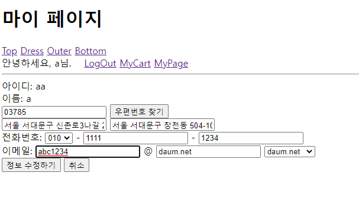

# Servlet/Jsp Web 미니 쇼핑몰 프로젝트
___
 
## 프로젝트 구조
모든 페이지 구성은 MVC 패턴으로 제작했습니다. Servlet은 전부 Controller로써만 사용되고 화면 구현이 수월한 JSP로 View를 구성했습니다. Oracle DataBase의 테이블을 바탕으로 DTO클래스 작성, DAO와 Service 객체로 Model Class 구성하고 MyBatis로 DB에 접근하였습니다.

## DB 모델 및 구조
**MEMBER(회원관리 테이블)**   
  
   
**GOODS(상품 테이블)**   
  
  
**CART(장바구니 테이블)**  
  
  
**ORDERINFO(주문정보 테이블)**  
  
  

## 기능 및 세부 내용
 - 회원가입(Ajax로 아이디 중복과 비밀번호 확인 시 일치 여부 체크)
    
  ___
 - 아이디 찾기(Java Mail API 사용하여 가입 정보의 메일로 발송)
   
   
   
 ___
 - 마이페이지(회원정보 수정)  
    
    
  
 ___   
 - 회원가입, 회원정보수정 시에 Daum 우편번호 서비스 API 사용   
    
 ___
 - 상품 카테고리(분류별로 상품들의 이미지가 뜨도록)   
    
    
 ___
 - 장바구니(상품 수량 변경, 장바구니 상품 삭제, 복수의 상품 선택하여 제어)   
    
    
    
    
 ___
 - 상품 이미지 보이기, 장바구니에서 상품 옵션 변경 등 DB Query로 CRUD 제어
  

 - Servlet 내의 Filter API 사용하여 모든 HTTP 요청과  응답 사이에 부가적인 작업 처리 가능하도록 설정  
     
  ___
 - 로그인이 필요한 서비스는 세션으로 제어.  
  (로그아웃 시 접근 불가하도록)     
     

## 기술 스택 및 환경
FrontEnd - HTML5, CSS3, Javascript(+jQuery, Ajax)  
BackEnd - Java(v1.8), Servlet&JSP, Oracle DataBase, MyBatis  
Eclipse(v4.16.0) 환경에서 개발

## 보완점 및 리뷰
* 처음 해본 웹 개발이라 배포까지는 시도해보지 못 한 점이 가장 아쉽다. 
* 로그인 시에 구글 api 등을 써보면 좋았을 것 같다.
* UI가 기본적이고 디자인적인 매력은 떨어진다.
* 기능적인 것들을 더 많이 넣어보고 싶었는데 건드려야 하는 부분이 한 두개가 아니란 것을 확연히 깨달았다.
* 화면 혹은 기능 하나를 구현하는 데에 Servlet과 JSP파일, Java클래스까지 파일 수가 기하급수적으로 늘다 보니 헷갈리는 것이 많았다. 비슷한 내용의 코드를 다시 재사용하게 되는 경우도 많은데, 표기법도 섬세하게 통일해주는 게 가독성에도 좋을 것 같다.